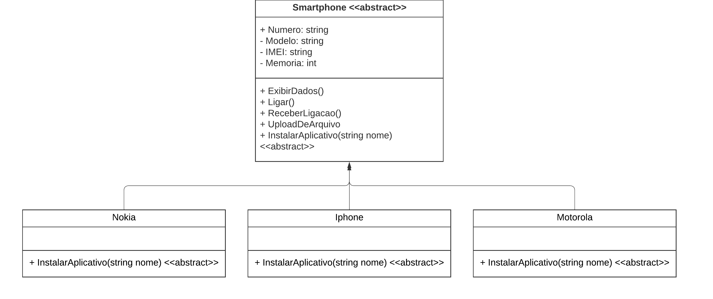

# DIO - Trilha .NET - Programação orientada a objetos
www.dio.me
# Esse projeto aborda os seguintes pilares de POO
### Abstração
### Encapsulamento
### Herança
### Polimorfismo

# Descrição

1. A classe **Smartphone** é abstrata, não permitindo instanciar e servindo apenas como modelo.
2. A classe **Nokia** , **Iphone** e **Motorola** são classes filhas de Smartphone.
3. O método **InstalarAplicativo** é sobrescrito na classe Nokia, iPhone e Motorola, pois ambos possuem diferentes maneiras de instalar um aplicativo.

